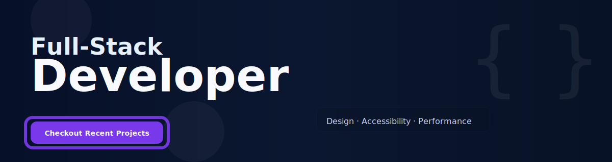

<!--
	Modern, aesthetic profile README
	- Clean hero, badges, stats, skills, projects, contact
	- Uses lightweight external shields & GitHub readme-stats
-->

<!-- Profile image -->

	

	<strong style="font-size:22px">Hi, I'm Immanuvel</strong>
	 
	<em>Design-focused full-stack developer building polished, high-performance apps.</em>

<!-- Contact badges: accessible, responsive -->

	
	
	
	
	

---

<!-- Hero / banner -->
<!-- Animated banner (SVG) -->

	

<!-- Fallback static banner -->

	

---

## About Me

I'm an early-career Full-Stack Developer focused on building accessible, high-performance web applications and useful developer tools. I combine practical UI design with reliable engineering to deliver production-ready features and improve developer experience.

- Location: Chennai, Tamil Nadu, India
- Open to: Full-time opportunities, Collaborations, Contract work, Mentorship
- Pronouns: He/Him

---

## Highlights

- Passion for clean UX and visual language
- Practical experience building frontend and backend applications
- Advocate for accessibility, performance, and developer experience
## Resume

**IMMANUVEL B**  
**Junior Software Developer**

**CONTACTS**  
Chennai, Tamil Nadu | +91 63829-24427 | rvimman@gmail.com | [LinkedIn](https://linkedin.com/in/rvimman) | [Portfolio](https://rvimmandev.vercel.app)

### Professional Summary

Innovative Junior Full Stack Developer with experience in building scalable web applications using the MERN stack (MongoDB, Express, React, Node.js), FastAPI and cloud technologies. Proven track record of improving application performance by 30% and enhancing user engagement through responsive UI design. Committed to Agile methodologies and delivering high-quality, end-to-end software solutions.

### Technical Skills

- Languages: JavaScript (ES6+), TypeScript, HTML5, CSS3, Java, Python
- Frontend: React, Redux, Next.js, Tailwind CSS, React Native, Shadcn
- Backend: Node.js, Express.js, FastAPI, RESTful APIs, GraphQL, OAuth 2.0
- Databases & Cloud: MongoDB, PostgreSQL, MySQL, Redis, Cloudinary, Supabase
- DevOps & Testing: Git, Docker, AWS (EC2, S3), Vercel, Playwright, Postman

### Work Experience

**Junior Full Stack Developer** | Wedzat | Dec 2025 – Present

- Optimized backend API response times by 25% by restructuring database queries in MongoDB and implementing a Redis caching layer.
- Accelerated frontend development by 30% by converting Figma prototypes into modular, reusable React components for rapid deployment.
- Developed and deployed 5+ responsive features using React and FastAPI, resulting in a 15% increase in mobile user retention.
- Architected a secure messaging system using WebSocket and REST, reducing AWS rate-limit by 40%.
- Collaborated with a cross-functional team of 6 using Agile Scrum to deliver a major feature upgrade 2 weeks ahead of schedule.
- Ported core features and logic to a mobile application using React Native.

### Key Projects

**Kassandra — Personalised AI Assistant** ([Live](https://rvimmandev.vercel.app/projects/kassandra))

- Built an AI chatbot using RAG and intent recognition, achieving 95% response accuracy.
- Implemented TTS and STT features, improving conversation engagement by 20%.
- Trained the chatbot for efficient learning from user interactions, reducing repetitive queries by 30%.
- Achieved a 100% accessibility score on Lighthouse by implementing semantic HTML and ARIA roles.
- Tech Stack: Next.js, Shadcn, Hugging Face, VectorDB, Firebase, TypeScript

### Education

- Bachelor of Engineering in Computer Science | Anna University | 2025
- Diploma in Computer Engineering | Anna University | 2022

### Certifications

- Machine Learning A-Z: Python, R
- UI/UX Designer — Growth School

[Download full resume (PDF)](assets/Immanuvel__Resume.pdf)

## Skills & Tools

	
	
	
	
	
	

	

### I enjoy working on

- Frontend architecture & component systems
- Design systems, animations, and micro-interactions
- Scalable APIs and server-side rendering
- Developer tools: CLIs, templates, generators

---

## Projects — Selected

- **Kassandra — Personalised AI Assistant** ([Live](https://rvimmandev.vercel.app/projects/kassandra))
- **Stunning UI Kit** — A component library emphasizing accessibility and motion design. (React + TypeScript)
- **PerfOps** — Tooling for measuring and improving web performance at scale.
- **DevFlow CLI** — Productivity CLI for scaffolding polished projects.

For more, see my [portfolio](https://rvimmandev.vercel.app) or [GitHub repositories](https://github.com/Inman2004?tab=repositories).

---

## GitHub Stats

	
	

---

## Get in Touch

- Email: rvimman@gmail.com
- LinkedIn: [linkedin.com/in/rvimman](https://linkedin.com/in/rvimman)
- Portfolio: [rvimmandev.vercel.app](https://rvimmandev.vercel.app)

Feel free to reach out for collaborations, open-source ideas, or coffee chats — I reply to thoughtful messages.

---

## Support & Tips

If you find my projects helpful, consider starring repositories or sharing feedback. For paid work, reach out via email or LinkedIn.

---

> "Design is the silent ambassador of your brand." — Let my work speak with clarity and craft.

---

<!-- Footer: lightweight decorative gradient -->

	

